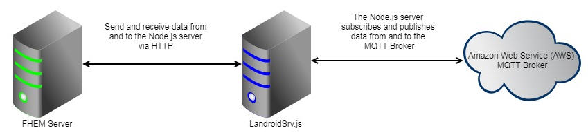

# fhem-landroid-s
Worx Landroid-S Module for FHEM SmartHome. Compatible with Worx Landroid S/M/L Models



## Change Log
```
- 1.0 (23.09.17): 	Receive Readings from Landroid S Mower
- 1.1 (25.11.17): 	set Mower commands and change configuration is now supported
- 1.2 (06.02.18): 	No polling to AWS server (Worx compliant)
- 1.3 (18.05.18): 	Auto Readings update after FHEM restart
			Enable multi mower configuration
			Counter for totalBladeTime with reset function
			New mower status support
			Set sliders for MowTimeExtent and MowRainDelay values prefilled (FHEMWEB)
- 1.4 (21.08.18):	Pause function
- 1.5 (01.10.18):	Landroid M support
- 1.6 (30.04.19):	New error code 16 (Mower locked) and 17 (Battery temp out of range)
			New peristant variable for bladeTimeOffset
			Trigger stopMower while Pause
- 1.7 (01.10.19):	Compatible with ioBroker.worx from MeisterTR
			edgeCutting
```
Installation Guide on Raspberry PI (Debian)

## 1. Install Node.js (min. Node 4.X.X)

  https://www.einplatinencomputer.com/raspberry-pi-node-js-installieren/

  If you have the following error after Node.js installation (ARMV61)
  node: /usr/lib/arm-linux-gnueabihf/libstdc++.so.6: version `GLIBCXX_3.4.18' not found (required by node)

  https://askubuntu.com/questions/575505/glibcxx-3-4-20-not-found-how-to-fix-this-error

  Run:
  sudo apt-get install libstdc++6


## 2. Install FHEM Landroid-S Adapter
  
  - requirement if not already done
  
    $ sudo apt-get install git 
    
  - Switch to directory
  
    $ cd /opt
    
  - Create new folder
  
      sudo mkdir landroid
  
  - Change Owner and rights (Same like your login user)
  
      $ sudo chown (YOUR LOGIN USER) landroid
      
      $ sudo chmod 777 landroid
 
  - Switch to directory
  
    $ cd landroid
    
  - Download fhem-landroid-s package from GIT
  
    $ git clone https://github.com/axelmohnen/fhem-landroid-s.git
    
  - Switch directory

    $ cd fhem-landroid-s
    
  - Install ioBroker worx adapter
  
    $ sudo npm install iobroker.worx
    
  - Copy Landroid perl module to FHEM
    
    $ cp 74_LANDROID.pm /opt/fhem/FHEM
    
  - Change owner and group of module like for the other modules in the same folder (FHEM User and Group)
  
    $ sudo chown (FHEM USER) /opt/fhem/FHEM/74_LANDROID.pm
    
    $ sudo chgrp (FHEM GROUP) /opt/fhem/FHEM/74_LANDROID.pm
    
  - Edit Landroid Adapter config File (Worx Login data)
    
    $ nano LandroidConf.json
    
      Change email address for mower1 (if you have more mowers please enter email for mower2 etc..)
      
      Change password for mower1 (if you have more mowers please enter pwd for mower2 etc..)
      
      Press CTRL-o  to save changes
      
      Press enter to confirm filename to write
      
      Press CTRL-x to exit nano
      
  - Execute node server for testing (exit afterwards with CTRL-C)
  
    $ node LandroidSrv.js mower1
    
    Result:
    
      get  https://pastebin.com/raw/xD6ZPULZ ->  200
      
      get  https://www.symantec.com/content/en/us/enterprise/verisign/roots/VeriSign-Class%203-Public-Primary-Certification-Authority-G5.pem ->  200
      
      Wed, 18 Oct 2017 19:10:23 GMT --> Connected to mower
      
      Wed, 18 Oct 2017 19:10:23 GMT --> Landroid WebServer: server initialized
      
      Wed, 18 Oct 2017 19:10:23 GMT --> Landroid WebServer: server running

## 3. Install FHEM Module 74_LANDROID

  - Install Perl JSON Module
  
    $ sudo apt-get install libjson-pp-perl
    
  -	Define Landroid device in FHEMWEB. Use "localhost" as host if the LandroidSrv.js is running on same machine. Otherwise choose the     IP address of external server. The default port is 8001 and must not be defined.
  
    define robbi LANDROID localhost
    
    Press "Save config"
    
    Set attribute “disable” equal 0 (default = 1)
    
    Set attribute "port" if differ to default port 8001

    Press "Save config"
    
    Default "interval" is set to 180sec
    
    


## 4. Setup process manager for Node.js applications

  - Install Process manager
  
    $ sudo npm install pm2 -g
  
  - Start your landroid server in background
  
    Run command for each mower (mower1, mower2, etc...)
    
    $ pm2 start /opt/landroid/fhem-landroid-s/LandroidSrv.js -f -- mower1
    
    $ pm2 start /opt/landroid/fhem-landroid-s/LandroidSrv.js -f -- mower2
  
  - Check Process Monitoring (your landroid server must be up and running before continuing)
  
    $ pm2 list 
    
    or
    
    $ pm2 show LandroidSrv (for more details)
  
  - Setup Startup/Boot management
  
    $ pm2 startup
    
    copy/paste and execute given command in order to build startup script
    
    $ pm2 save
  
  - Restart PI
  
    $ sudo shutdown -r now
  
  - Use the following command after update of file LandroidSrv.js (e.g. newer version)
  
    $ pm2 restart /opt/landroid/fhem-landroid-s/LandroidSrv.js -f -- mower1
 
 ## 5. Set commands
  - startMower: Start Mower (no parameter needed)
  
  - stopMower: Going back to docking station (no parameter needed)
  
  - pauseMower: Pause Mower (no parameter needed)
  
  - changeCfgCalendar: Set calendar per weekday
  ```
    	Example: 0,10:00,300,1
      		- weekday 0-6 (0 = Sunday, 6 = Saturday)
      		- starttime (hh:mm) (e.g 10:00)
      		- worktime in minutes (value between 0 and 720)
      		- bordercut (1 = bordercut on, 0 = bordercut off)
  ```
		
  - changeCfgTimeExtend: Set mowing time extension (Percentage value -100 to 100)

  - changeCfgArea: Set mowing area (Zone)	
  ```
  	Example: 0,450
			- Area ID 0-3 (0 = Area 1, 3 = Area 4)
			- Starting Point in meters 0 - 500
  ```
  
  - startSequences: Defines the sequence of area which the mower will enter and
  		    the percentage how long the mower will run in each area.
  		    Each digit of the sequence means 10% of the daily time frame.
  ```
  	Example: 0,0,0,0,0,0,0,0,0,0 = 100% area 1
		Example: 0,0,0,0,0,1,1,1,1,1 = 50% area 1 / 50% area 2
		Example: 0,0,1,1,2,2,2,3,3,3 = 20% area 1 / 20% area 2 / 30% area 3 / 30% area 4
  ```
  
  - changeRainDelay: Set Rain delay in minutes (value between 0 and 300)
  - resetBladeTimeCounter: Resets the READING "bladeTimeCounter"
  - edgeCutting: Start edge cutting (no parameter needed)
  
 ## 6. Appendix
 
  - Status codes
  ```
  	0 => "Idle",
       	1 => "Home",
       	2 => "Start sequence",
       	3 => "Leaving home",
       	4 => "Follow wire",
       	5 => "Searching home",
       	6 => "Searching wire",
       	7 => "Mowing",
       	8 => "Lifted",
       	9 => "Trapped",
       	10 => "Blade blocked",
       	11 => "Debug",
       	12 => "Remote control",
       	30 => "Going home",
       	31 => "Zone Training",
       	32 => "Edge cutting",
       	33 => "Searching zone",
       	34 => "Pause"
  ```
  
  - Error codes
  ```
  	0 => "No error",
       	1 => "Trapped",
       	2 => "Lifted",
       	3 => "Wire missing",
       	4 => "Outside wire",
       	5 => "Raining",
       	6 => "Close door to mow",
       	7 => "Close door to go home",
       	8 => "Blade motor blocked",
       	9 => "Wheel motor blocked",
       	10 => "Trapped timeout",
       	11 => "Upside down",
       	12 => "Battery low",
       	13 => "Reverse wire",
       	14 => "Charge error",
       	15 => "Timeout finding home"
	16 => "Mower locked"
    	17 => "Battery over temperature"
  ```
  

